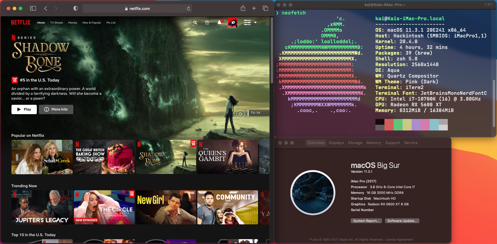

# Big Sur Hackintosh on the ASUS STRIX Z490F via OpenCore 0.6.9 with Navi GPU HW Acceleration

Hi! This repo is a result of me following [Dortania's OpenCore Install Guide](https://dortania.github.io/OpenCore-Install-Guide/), and I insist you do the same for your Hackintosh. Here you can find my personal EFI folder using OpenCore 0.6.9 for use with my Hackintosh. I tend to update this repo as new macOS versions become available, in which case I'll update to the latest available OpenCore release plus kexts around that time. If you have hardware similar to mine you can probably use my EFI folder without much modification, if you intend to do so read on.

<!-- toc -->

## Hardware

Here's the usual info screenshot plus Netflix working on Safari, a sign of working GPU HW Acceleration & DRM content. 

- Motherboard: ASUS STRIX Z490F
- Networking:
    - Ethernet: Intel I225-V
    - WiFi + Bluetooth: Fenvi T919 (BCM94360CD)
- CPU: Intel i7 10700K
- GPU: SAPPHIRE PULSE AMD Radeon RX 5600 XT 
- RAM: G.SKILL Aegis 16GB
- SSD: Kingston 500GB A2000 M.2 2280 NVME SSD
- Case: NZXT H510i (2020)

## Working
Everything appears to be working **OK**, except for the native macOS updater as of macOS 11.2 and some minor sleep bugs, detailed below.

## Not Working
### 1. Updating OS via macOS Software Update utility
OS updates appear to install, but don't seem to take any effect, aside from successfully updating the recovery partition. Likewise duplicate macOS boot options appear in the OpenCore selector menu post update. This issue seems to have occurred since Apple released macOS 11.2, as the native updater prior to 11.2 was working as intended. This is possibly due to errors in the CSR partition, but I've yet to fully verify this. SIP seems to be working and OK, but might also be the source of this bug.

Current solution is to either install OS updates natively and proceed with a clean install via the updated recovery (migrating all user data via time machine backup restore), or to simply use the internet recovery (untested) to wipe and reinstall the latest macOS (again migrating user data via time machine). Either way keep a bootable USB handy to proceed with the reinstall, as the EFI partition gets wiped when erasing and reformating the macOS boot drive.

### 2. Sleep bugs
This isn't actually so much an issue with going to sleep but rather staying asleep continuously. Occasionally the machine will at random wake itself from sleep, waking for approximatley 2-15 seconds, and then returning to sleep. This is most likely caused by a USB peripheral, the Intel NIC or perhaps powernap working as intended, but I've neglected to investigate this further due to this being a very minor annoyance rather than an actual issue. Likewise this same bug occurs when sleeping on windows, which leads me to believe its caused by the two formers rather than the latter of the three.

## Usage
Feel free to use my personal EFI folder for your own Hackintosh projects, just be careful as your config needs may differ depending on your hardware, which may or may not result in failed boots, errors, or loss of data; All of which I bear NO responsibility for. You should follow [Dortania's OpenCore Install Guide](https://dortania.github.io/OpenCore-Install-Guide/) for configuring and installing OpenCore for your machine.

Otherwise if you do wind up using my config.plist make sure to add the proper values for MLB, ROM, SystemSerialNumber,   and SystemUUID under the platforminfo section. More info on this is detailed in [Dortania's guide](https://dortania.github.io/OpenCore-Install-Guide/config.plist/comet-lake.html#platforminfo).

To automatically keep up to date with this project, I recommend cloning this repo. 
- `gh repo clone ocean-bee/asus-strix-z490f-hackintosh`

Note: To enable GPU hardware acceleration for my AMD Navi card I had to use the iMacPro1,1 SMBIOS. This differs from the official OpenCore guide for Comet Lake which suggests using the iMac20,X SMBIOS. For whatever reasons GPU hardware acceleration would fail when using it. While I've had zero negative consequences using the iMacPro1,1 SMBIOS YMMV, in which case you can alternatively use the MacPro7,1 SMBIOS to enable GPU HW acceleration. Though, keep in mind you will have to fix the Memory Modules Misconfigured error which is detailed [here in Dortania's guide](https://dortania.github.io/OpenCore-Post-Install/universal/memory.html#mapping-our-memory).

As well, if you're using a different motherboard / case, your USB ports will most likely differ in some way, which means you'll need to generate your own **USBmap.kext**. This process is detailed [here in Dortania's guide](https://dortania.github.io/OpenCore-Post-Install/usb/).